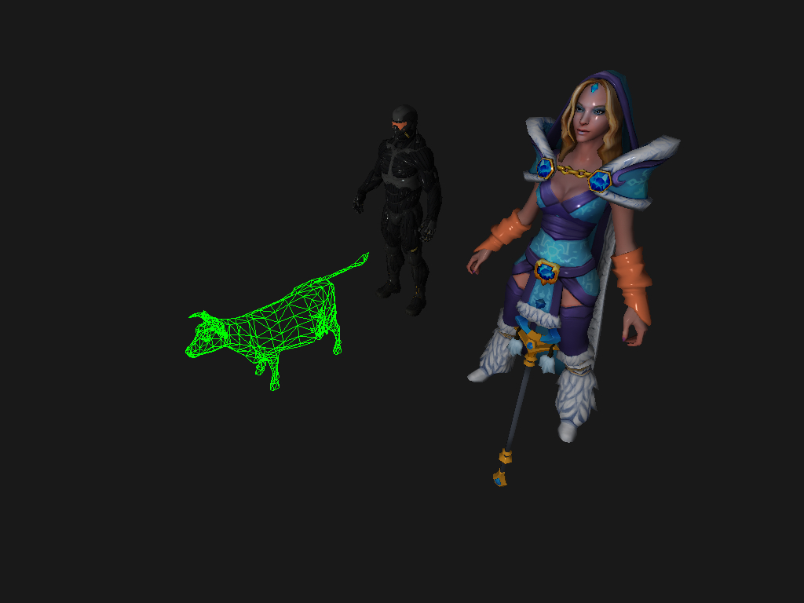
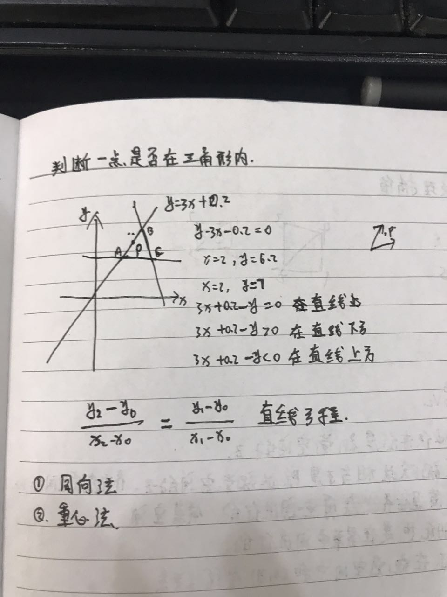

# SoftRasterization（[软光栅化工程](https://github.com/superman-t/SoftRasterization)）
下图为软光栅渲染的出的3D模型，线框模式的牛，纹理模式的Dota2冰女模型，以及纳米粒子模型。
<div  align="center">    

</div>
  

### 主要特性 ###
- 集成assimp库加载模型
- 使用stb_image库load模型纹理和生成渲染纹理
- Matrix4、Vector2、Vector3、Vector4数学库
- 基本的顶点着色器和像素着色器
- 背面剔除——以缠绕顺序为判断标准
- CVV空间裁剪
- NDC空间到屏幕空间的映射
- 纹理采样过滤——线性过滤和邻近过滤
- 深度缓冲
- 光栅化三角形
- 基于三角形重心的坐标插值
- bresenham画线算法，三角形填充算法
- 基本光照——环境光照、漫反射光照、镜面高光,基于模型材质贴图
- cmake跨平台编译，主要实现Windows和MacOS这两个平台

### 运行方法 ###

## windows平台 ##
拉取工程
```bash 
  git clone --recurse-submodules https://github.com/superman-t/SoftRasterization
```
- 确保装有Cmake，Virtual Studio软件，DirectX
- 在工程根目录下建立一个build文件夹，
- 打开Cmake gui界面，source code选择工程根目录，binaries选择上一步建立的build文件夹
- 点击configure，Generate，Open Project将使用VS打开工程
- 运行工程中的SoftRender项目，将在build下生成渲染出的screenshot.jpg图片

## Mac OS ##
```bash
克隆工程到本地
git clone --recurse-submodules https://github.com/superman-t/SoftRasterization  
进入工程根目录
cd SoftRasterization
建立工程build文件夹
mkdir build
cd build
cmake ..
无bug的话将生成Makefile文件
make
生成可执行文件
./SoftRender
运行后将在当前目录生成渲染出来的screenshot.jpg文件
```
### 开发过程手稿 ###
<div  align="center">    





</div>


